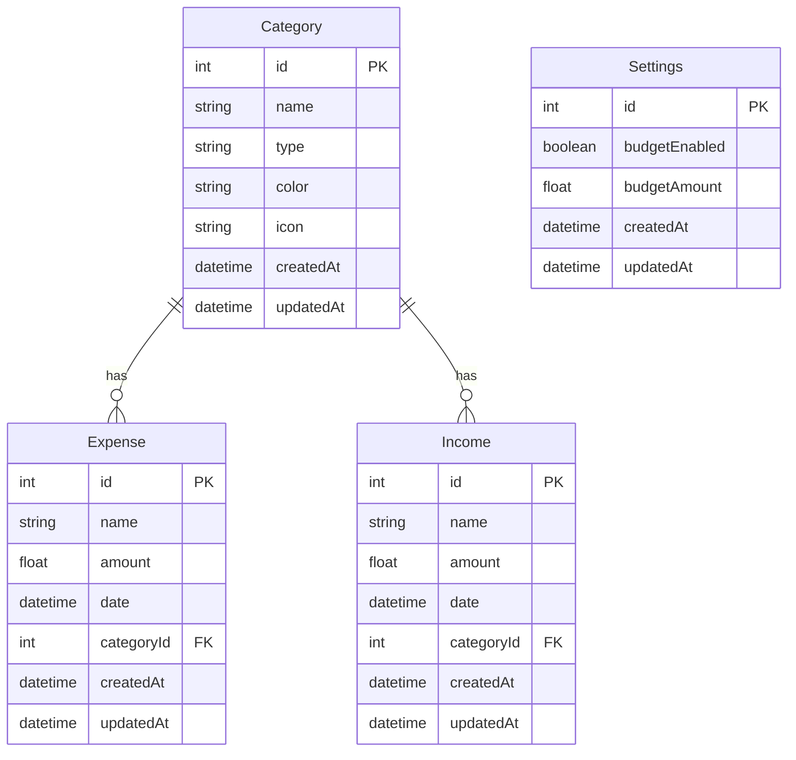

# Seminaarityö: Express.js ja TypeScript backend-kehityksessä

## Johdanto

Tämän seminaarityön tavoitteena oli tutustua Express.js-frameworkiin ja TypeScript-kielellä toteutettuun backend-kehitykseen osana BuduTracker-mobiilisovelluksen kehitystä. Aiempi kokemukseni backend-kehityksestä perustuu Javan Spring Bootiin, joten työssä vertailen näiden kahden ekosysteemin eroja ja samankaltaisuuksia.

BuduTracker on henkilökohtainen budjetointisovellus, jossa käyttäjä voi seurata tulojaan ja menojaan kategorioiden mukaan. Backend tarjoaa REST API:n React Native -mobiilisovellukselle.

## Teknologiavalinnat

### Express.js

Express on Node.js:n minimalistinen ja kevyt web-framework, joka tarjoaa helposti luotavan perustan web- ja mobiilisovelluksille. Valitsin Expressin, koska:

- Olen lähiaikoina ollut enemmän tekemisissä Java/Typescriptin kuin Javan kanssa ja kiinnostunut backend kehityksestä myös muilla frameworkeillä kuin Spring Bootilla
- Luin että se on kevyt ja joustava verrattuna Spring Bootin "opinionated" lähestymistapaan
- Yksinkertainen routing ja middleware-arkkitehtuuri

### TypeScript

TypeScript tuo staattisen tyypityksen JavaScriptin päälle, mikä:

- Vähentää runtime-virheitä
- Parantaa kehittäjäkokemusta automaattitäydennyksellä
- Tekee koodista ylläpidettävämpää

### Prisma ORM

Prisma on moderni ORM (Object-Relational Mapping) työkalu, joka:

- Tarjoaa type-safe tietokantakyselyn
- Generoi TypeScript-tyypit automaattisesti skeemasta
- Helpottaa tietokantamigraatioita
- Tukee useita tietokantoja (käytössä SQLite kehityksessä)

### SQLite

Kehitysvaiheessa käytetty kevyt tietokanta, joka:

- Ei vaadi erillistä tietokantapalvelinta
- Sopii hyvin prototyyppivaiheeseen ja tässä projektissa mahdollisesti jopa loppuratkaisuksi
- Helppo siirtää tuotantoon esim. PostgreSQL:ään

## Projektin rakenne

```
backend/
├── src/
│   ├── controllers/         # Liiketoimintalogiikka
│   │   # Controllerit toteuttavat säännöt, käyttävät DTO:ita, tekevät Prisma-kyselyt ja muotoilevat palautteen. Eivät sisällä validointia.
│   │   ├── categoryController.ts
│   │   ├── expenseController.ts
│   │   ├── incomeController.ts
│   │   └── settingsController.ts
│   ├── lib/
│   │
│   │   └── db.ts            # Prisma client (tietokantakyselyt).
│   ├── middleware/          # Validointi ja virheenkäsittely
│   │   # Suorittaa ajonaikaisen datan tarkistuksen ja tyyppimuunnokset (esim. string -> Date). Sisältää myös globaalin virheenkäsittelijän.
│   │   └── validation.ts    # Käyttää DTO:oita
│   ├── routes/              # Reititys
│   │   # Määrittelee API-endpointit (esim. GET/POST /expenses) ja niiden kulun: kutsuu middlewaren, sitten controllerin metodin.
│   │   ├── categories.ts
│   │   ├── expenses.ts
│   │   ├── incomes.ts
│   │   └── settings.ts
│   ├── types/               # TypeScript-tyypit
│   │   # Sisältää kaikki projektin sisäiset tyypit.
│   │   └── dto/             # Data Transfer Objects (DTO)
│   │       # Määrittää tarkat datan "sopimukset" (end-to-end tyyppiturvallisuus).
│   │       ├── category.dto.ts
│   │       ├── expense.dto.ts
│   │       ├── income.dto.ts
│   │       └── settings.dto.ts
│   └── index.ts             # Sovelluksen käynnistyspiste
│       # Express-alustus, reittien ja globaalien middlewarejen rekisteröinti.
├── prisma/
│   # Tietokannan hallinta ja konfiguraatio.
│   ├── migrations/          # SQL-migraatiohistoria.
│   ├── dev.db               # SQLite-tietokantatiedosto.
│   ├── schema.prisma        # Tietokantamalli.
│   └── seed.ts              # Testidatan alustus.
├── package.json
└── tsconfig.json
```

---

## Toteutus

### 1. REST API -endpointit

Backend tarjoaa CRUD-operaatiot (Create, Read, Update, Delete) kolmelle resurssille:

#### Expenses (Menot)

```typescript
GET    /api/expenses              // Hae kaikki menot tai suodata kuukauden mukaan
GET    /api/expenses/:id          // Hae yksittäinen meno
POST   /api/expenses              // Luo uusi meno
PUT    /api/expenses/:id          // Päivitä meno
DELETE /api/expenses/:id          // Poista meno
```

#### Incomes (Tulot)

```typescript
GET    /api/incomes?month=2024-11 // Hae tulot (optionaalinen kuukausisuodatus)
POST   /api/incomes              // Luo uusi tulo
PUT    /api/incomes/:id          // Päivitä tulo
DELETE /api/incomes/:id          // Poista tulo
```

#### Categories (Kategoriat)

```typescript
GET    /api/categories            // Hae kaikki kategoriat
GET    /api/categories/:type      // Hae kategoriat tyypin mukaan (income/expense)
POST   /api/categories            // Luo uusi kategoria
PUT    /api/categories/:id        // Päivitä kategoria
DELETE /api/categories/:id        // Poista kategoria
```

Sekä (GET, PUT) Settings taululle, joka kuvaa budjettia:

#### Settings (Asetukset)

```typescript
GET / api / settings; // Hae sovelluksen asetukset (budjetti)
PUT / api / settings; // Päivitä asetukset
```

---

### 2. Tietokantakaavio



**Tietokantarelaatiot:**

- Yksi kategoria voi sisältää useita menoja (1:N)
- Yksi kategoria voi sisältää useita tuloja (1:N)
- Jokaisella menolla ja tulolla on pakollinen kategoria
- Settings-taulu säilyttää sovelluksen budjetin.

---

### 3. Keskeisiä toteutusratkaisuja

#### Kuukausisuodatus query-parametrillä

```typescript
router.get("/", async (req: Request, res: Response) => {
  const { month } = req.query;

  let whereClause: any = {};

  if (month && typeof month === "string") {
    const [year, monthNum] = month.split("-");
    const startDate = new Date(parseInt(year), parseInt(monthNum) - 1, 1);
    const endDate = new Date(parseInt(year), parseInt(monthNum), 0, 23, 59, 59);

    whereClause = {
      date: { gte: startDate, lte: endDate },
    };
  }

  const incomes = await prisma.income.findMany({
    where: whereClause,
    include: { category: true },
  });

  res.json(incomes);
});
```

**Opittu:** RESTful API:ssa query-parametrit ovat standardi tapa suodattaa dataa. Tämä parantaa suorituskykyä, koska backend palauttaa vain tarvittavan datan sen sijaan että frontend lataisi kaiken ja suodattaisi itse.

#### Desimaalilukujen käsittely

```typescript
const amount = parseFloat(req.body.amount.toString().replace(",", "."));
const roundedAmount = parseFloat(amount.toFixed(2));
```

**Opittu:** JavaScript ja TypeScript käyttävät pistettä desimaalierottimena, mutta suomalaiset käyttäjät syöttävät pilkkuja mobiililaitteilla. Backend täytyy normalisoida nämä ennen tallennusta. Lisäksi JSON-serialisointi voi kadottaa desimaalit, joten ne täytyy pakottaa 2 desimaalin tarkkuuteen.

---

## Spring Boot vs. Express.js - Vertailu

### Arkkitehtuuri

**Spring Boot:**

- Vahva konventioihin perustuva rakenne
- Dependency Injection sisäänrakennettuna
- Annotaatio-pohjainen konfiguraatio (`@RestController`, `@Service`, `@Autowired`)
- Monimutkainen, mutta skaalautuva

**Express.js:**

- Minimalistinen, "unopinionated"
- Middleware-ketju käsittelee pyyntöjä
- Funktionaalinen lähestymistapa
- Yksinkertainen, mutta vaatii enemmän manuaalista työtä

---

### Routing

**Spring Boot:**

```java
@RestController
@RequestMapping("/api/expenses")
public class ExpenseController {

    @GetMapping
    public List<Expense> getAllExpenses() {
        return expenseService.findAll();
    }

    @PostMapping
    public Expense createExpense(@RequestBody Expense expense) {
        return expenseService.save(expense);
    }
}
```

**Express.js:**

```typescript
const router = express.Router();

router.get("/", async (req, res) => {
  const expenses = await prisma.expense.findMany();
  res.json(expenses);
});

router.post("/", async (req, res) => {
  const expense = await prisma.expense.create({ data: req.body });
  res.json(expense);
});

export default router;
```

**Huomiot:**

- Express on suoraviivaisempi
- Spring Boot abstraktoi enemmän (esim. automaattinen JSON-serialisointi)
- Express vaatii manuaalista error handling -logiikkaa

---

### ORM ja tietokantakyselyt

**Spring Boot (JPA):**

```java
public interface ExpenseRepository extends JpaRepository<Expense, Long> {
    List<Expense> findByCategory(Category category);

    @Query("SELECT e FROM Expense e WHERE e.date BETWEEN :start AND :end")
    List<Expense> findByDateRange(LocalDate start, LocalDate end);
}
```

**Express.js (Prisma):**

```typescript
// Prisma generoi type-safe kyselyn
const expenses = await prisma.expense.findMany({
  where: {
    category: { name: "Ruoka" },
    date: {
      gte: startDate,
      lte: endDate,
    },
  },
  include: { category: true },
});
```

**Huomiot:**

- Molemmat tarjoavat type-safety:n
- Prisma on modernimpi ja käyttää fluent API:a
- JPA on monimutkaisempi mutta tehokkaampi suurissa sovelluksissa
- Prisma Client generoidaan automaattisesti skeemasta

---

### Konfiguraatio

**Spring Boot:**

```properties
# application.properties
spring.datasource.url=jdbc:postgresql://localhost:5432/mydb
spring.jpa.hibernate.ddl-auto=update
server.port=8080
```

**Express.js:**

```bash
# .env
DATABASE_URL="file:./dev.db"
PORT=3000
```

**Huomiot:**

- Spring Boot vaatii enemmän konfiguraatiota
- Express on kevyempi, mutta vaatii manuaalista setupia
- Ympäristömuuttujat toimivat samalla tavalla

---

## Opitut asiat

### 1. TypeScript backend-kehityksessä

- TypeScript parantaa kehittäjäkokemusta automaattitäydennyksen ja virheiden havaitsemisen kautta
- Type-safe tietokantakyselyt Prisman kanssa vähentävät runtime-virheitä

### 2. Express.js middleware-arkkitehtuuri

```typescript
// Middleware-ketju
app.use(cors());
app.use(express.json());
app.use("/api/expenses", expenseRoutes);
app.use(errorHandler); // Custom error handling
```

- Middleware-funktiot käsittelevät pyyntöjä järjestyksessä
- Helppo lisätä esimerkiksi autentikaatio, logging, validointi
- Kevyempi kuin Spring Boot:n filter-chain

### 3. Prisma ORM

- Schema-first lähestymistapa: määrittele skeema, generoi client
- Migraatiot hallitaan Prisma CLI:llä
- Seed-skriptit testidatan luomiseen

### 4. RESTful API -suunnittelu

- Query-parametrit suodatukseen (`?month=2024-11`)
- HTTP-metodit semanttisesti oikein (GET, POST, PUT, DELETE)
- Oikeat HTTP-statuskoodit (200, 201, 404, 500)

---

## Haasteet ja ratkaisut

### 1. Desimaaliluvut ja lokalisaatio

**Haaste:** Suomalaiset käyttäjät syöttävät `15,22` mutta JavaScript `parseFloat()` ymmärtää vain `15.22`

**Ratkaisu:**

Helperfunktio, joka korvaa luvun pilkut pisteillä parseFloatille.

```typescript
const parseAmount = (value: any): number => {
  const parsed = parseFloat(value?.toString().replace(",", "."));
  if (isNaN(parsed) || parsed <= 0) {
    throw new ValidationError("Invalid amount - must be a positive number");
  }
  return parsed;
};
```

### 2. Kuukausisuodatus

**Haaste:** Frontend latasi kaikki tapahtumat ja suodatti ne, mikä ei olisi järkevää isommilla datamäärillä.

**Ratkaisu:** Siirrettiin suodatus backendiin query-parametrillä. Backend palauttaa vain tarvittavan datan.

### 3. JSON serialisointi ja desimaalit

**Haaste:** SQLite REAL-tyyppi palautui JSON:issa ilman desimaaleja (15.00 → 15)
**Ratkaisu:** Pakotettiin 2 desimaalin tarkkuus ennen JSON-serialisointia

---

## Jatkokehitysideat

### 1. Autentikaatio ja käyttäjähallinta

- JWT-tokenien käyttö
- Bcrypt salasanojen hashaykseen
- Käyttäjäkohtainen data

### 2. Validointi ja virheenkäsittely

- Zod-kirjasto input-validointiin
- Paremmat HTTP-vastaukset

### 3. Testaus

- Jest unit-testeille
- Supertest API-testaukseen
- Integration-testit tietokannalla

### 4. Tuotantovalmius

- Siirtyminen PostgreSQL:ään
- Docker-konttiin paketointi
- CI/CD pipeline

### 5. Dokumentaatio

- Swagger/OpenAPI dokumentaatio
- API-versiointi

---

## Yhteenveto

Tämä seminaarityö syvensi ymmärrystäni backend-kehityksestä Node.js-ekosysteemissä. Express.js ja TypeScript yhdistelmä tarjoaa modernin ja tehokkaan tavan rakentaa RESTful API:ta, vaikkakin se vaatii enemmän manuaalista konfiguraatiota verrattuna Spring Bootiin.

## Lähteet

- Express.js dokumentaatio: https://expressjs.com/
- Prisma dokumentaatio: https://www.prisma.io/docs
- TypeScript dokumentaatio: https://www.typescriptlang.org/docs/
- Node.js dokumentaatio: https://nodejs.org/docs/
- Ajatusten ja aiheiden sparraamiseen sekä virheiden debugaukseen hyödynnetty tekoälyjä, Claude Sonnet 4.5 sekä ChatGPT 5
